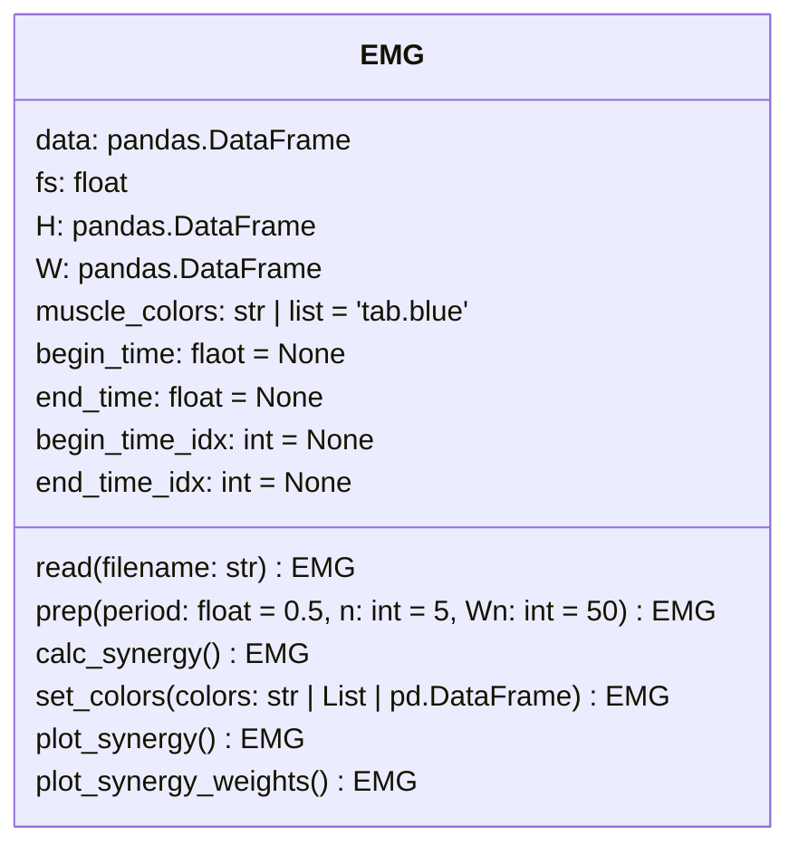

# measurexp.EMG
筋電位解析に必要なモジュール

以下の例では、
- EMG.csv  
  計測器から出力した筋電位データ



> 例 1
```py
from measurexp.EMG import EMG

emg = EMG()

# データ読み込み
emg.read('EMG.csv')

# 計測に使用する時間を設定
emg.set_time(0, 30)

# 下処理
emg.prep()

# 筋シナジーの計算
emg.calc_synergy()

# 筋シナジーのプロット
emg.plot_synergy()

# 色を選択 (CSV or カラーコード or カラーコードのリスト)
emg.set_colors('../muscle_colors.csv')

# 筋シナジー基底のプロット
emg.plot_synergy_weights()
```
